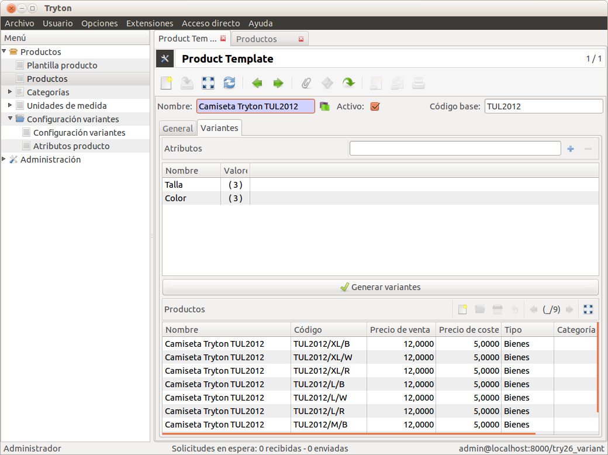

======================
Variantes del producto
======================

Este módulo permite definir atributos en los productos y generar sus variantes.
Un claro ejemplo es el de una camiseta, donde éstas disponen de diferentes
tallas y colores.

Por ejemplo, si al producto 'Tryton T-Shirt' le añadimos los siguientes
atributos:

* Color: Negro, Blanco, Rojo
* Talla: XL, L, M

El resultado de generar sus variantes sería el siguiente:

* Tryton T-Shirt N/XL
* Tryton T-Shirt N/L
* Tryton T-Shirt N/M
* Tryton T-Shirt B/XL
* Tryton T-Shirt B/L
* Tryton T-Shirt B/M
* ...

.. inheritref:: product_variant/product_variant:section:configuracion

Configuración
=============

Configuración
-------------

A través del menú |menu_product_configuration| defina el carácter separador que
se usará para los códigos, por ejemplo, la barra "/".

.. |menu_product_configuration| tryref:: product_configuration.menu_configuration/complete_name

.. inheritref:: product_variant/product_variant:section:atributos

Atributos
---------
Abra el menú |menu_product_attribute| para crear los atributos y los valores de
los mismos.

.. |menu_product_attribute| tryref:: product_variant.menu_product_attribute/complete_name

* Atributo: Color
* Valores del atributo: Negro, Blanco,...

El campo secuencia determina la ordenación de los atributos y el orden de
generación de los códigos de producto.

.. note:: Si de un atributo es similar a otro, pero sus valores son diferentes
          de sí, deberá crea atributos independientes con sus propios valores.

.. inheritref:: product_variant/product_variant:section:plantilla

Plantilla producto
==================

Abra el menú |menu_product_templates| para ver todas las plantillas de
productos, ya sean *simples* o con *variantes*.

.. |menu_product_templates| tryref:: product.menu_main_product/complete_name

Para crear variantes, haga clic en la pestaña variantes:

* Rellene el campo *Código base* si quiere un prefijo en el código de cada
  producto.
* Seleccione los atributos para los que desea crear variantes de este producto.
* Haga clic en el boto **Generar variantes** para crear las variantes de
  producto.

.. note:: Si después de generar las variantes de producto, algunas de ellas no
          existiesen, debería borrarlas antes de relacionarlas con pedidos de
          venta, de compra o con albaranes, puesto que de no hacer así, ya no
          podría borrarlas. Las variantes de producto, una vez se han vendido,
          o comprado, ya no se pueden borrar, sólo se pueden **desactivar**.

